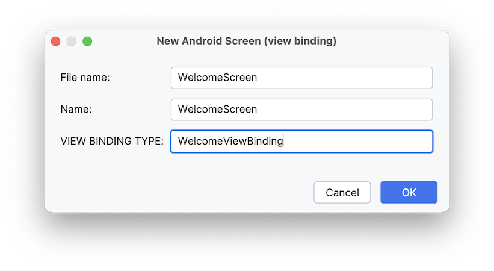

# Step 1

_Let's get something on the screen..._

## Setup

To follow this tutorial, launch Android Studio and open this folder (`samples/tutorial`).

The `tutorial-base` module will be our starting place to build from.

Go ahead and launch `TutorialActivity`. You should see this welcome screen:


You can enter a name, but the login button won't do anything.

## First Workflow

_Before anything else, make sure you have installed the [file templates](../../README-templates.md)._

We'll start by making pair of `Workflow` and `Screen` classes to back the provided `welcome_view.xml` layout.

First let's make `WelcomeWorkflow` from the _Stateful Workflow_ template, adding it to the `tutorial-base` module:


The template does not create everything needed.
Manually add placeholder `object`s for `State` and `Output`.

Note that we use the generic `com.squareup.workflow1.ui.Screen` type, for now (see more on that below).

```kotlin
object WelcomeWorkflow : StatefulWorkflow<Unit, State, Output, Screen>() {

  object State
  object Output

  override fun initialState(
    props: Unit,
    snapshot: Snapshot?
  ): State = TODO("Initialize state")

  override fun render(
    renderProps: Unit,
    renderState: State,
    context: RenderContext<Unit, State, Output>
  ): Screen {
    TODO("Render")
  }

  override fun snapshotState(state: State): Snapshot? = Snapshot.write {
    TODO("Save state")
  }
}
```

Use the _Android Screen (view binding)_ template to create a second file.



You will probably need to add an import for `WelcomeViewBinding` yourself,
and that Android view binding class might not exist until the first time you build.

```kotlin
import workflow.tutorial.views.databinding.WelcomeViewBinding

data class WelcomeScreen(
  // TODO: add properties needed to update WelcomeViewBinding
) : AndroidScreen<WelcomeScreen> {

  override val viewFactory =
    ScreenViewFactory.fromViewBinding(WelcomeViewBinding::inflate, ::welcomeScreenRunner)
}

private fun welcomeScreenRunner(
  private val viewBinding: WelcomeViewBinding
) = ScreenViewRunner<WelcomeScreen> { screen: WelcomeScreen, environment: ViewEnvironment ->
  TODO("Update viewBinding from screen")
}
```

So while our Workflow rendering type is `com.squareup.workflow1.ui.Screen`, we can actually
return a true `WelcomeScreen` (a sub-type) from render().

### `Screen`, `ScreenViewFactory`, and `ScreenViewRunner`

Let's start with what a "screen" is, and how it relates to views.

"Screen" is just the term we use to refer to a value type that represents the view model for a logical screen.
Screen types are identified by implementing the marker interface `Screen`.
Typically, a `Screen` class will be used as the rendering type for the `Workflow` that manages (presents) such screens.

At Square we tend to use the terms "screen", "rendering" and "view model" interchangeably.
And note that we said "view model," not "Jetpack ViewModel."
A workflow rendering is a view model in the classic sense:
a struct-like bag of values and event handlers that provide just the information needed to create a view,
with no coupling to the platform specific concerns of any particular UI system.

A `Screen` is usually a `data class`, since that's the easiest way to make value type-like classes in Kotlin.

Workflow provides two Android-specific interfaces that extend `Screen`:
`AndroidScreen` for classic views,
and `ComposeScreen` for `@Composable` functions.
This is an old tutorial written by old people, so we'll stay with `AndroidScreen` here.

Let's add a couple of fields to the `WelcomeScreen` that was created from the template,
to give it all the information it needs to serve as a view model:

```kotlin
import com.squareup.workflow1.ui.AndroidScreen
import com.squareup.workflow1.ui.ScreenViewFactory
import com.squareup.workflow1.ui.ScreenViewRunner
import com.squareup.workflow1.ui.ViewEnvironment

/**
 * @param promptText message to show the user
 * @param onLogInTapped Log In button event handler
 */
data class WelcomeScreen(
  val promptText: String,
  val onLogInTapped: (String) -> Unit
) : AndroidScreen<WelcomeScreen> {
```

Now we need to write the code that creates and updates a view based on this simple `WelcomeScreen` model.

Workflow's support for classic Android `View`s requires a `ScreenViewFactory` to be registered
for each type of `Screen` it may be asked to display.
A `ScreenViewFactory` receives a `Screen` of a particular type and creates a `View` to display it,
an a `fun interface ScreenViewRunner` to update that view.

Because it implements `AndroidScreen` our `WelcomeScreen` concisely satisfies this requirement (at compile time!) with this line that the template generated for us:

```kotlin
  override val viewFactory =
    ScreenViewFactory.fromViewBinding(WelcomeViewBinding::inflate, ::welcomeScreenRunner)
```

This line is declaring: to display a `WelcomeScreen` the workflow UI runtime should use the `viewFactory` provided here to inflate a `WelcomeViewBinding`
and update it as needed using a runner created by `welcomeScreenRunner()`.

Let's replace the `TODO("Update viewBinding from rendering")` bit from the template with some real code:

```kotlin
private fun welcomeScreenRunner(
  viewBinding: WelcomeViewBinding
) = ScreenViewRunner { screen: WelcomeScreen, _ ->
  viewBinding.prompt.text = screen.promptText
  viewBinding.logIn.setOnClickListener {
    screen.onLogInTapped(viewBinding.username.text.toString())
  }
}
```

To be clear:

- `welcomeScreenRunner` is called once, when `WelcomeViewBinding` is inflated
- the `ScreenViewRunner` that is created lives as long as the view does
- that runner's update lambda (`(WelcomeScreen, ViewEnvironment) -> Unit`) is invoked
  immediately, and again every time the UI needs to be refreshed

> [!TIP]
> There is no requirement that you use an XML layout.
> Besides `ScreenViewFactory.fromViewBinding` we also provide `ScreenViewFactory.fromCode`
> (to simplify building a `View` completely by hand) and a few other varieties.
>
> Or feel free to give `ComposeScreen` a try instead of `AndroidScreen`.
> There is a file template for that too.
> Add `implementation deps.workflow.compose` to your `build.gradle` `dependencies` and see how it goes.

We're not quite ready to run anything yet, as we still need to fill in the basics of our workflow.

### Workflows and Rendering Type

The core responsibility of a workflow is to provide a complete rendering / view model
every time the related application state updates.

Let's go into the `WelcomeWorkflow` now,
and have it return a `WelcomeScreen` from the `render()` method. Remember `WelcomeScreen` is a
sub-type of `com.squareup.workflow1.ui.Screen`, so we still satisfy the type binding.

While you're here, opt out of persistence by making `snapshotState` return `null`.

```kotlin
object WelcomeWorkflow : StatefulWorkflow<Unit, State, Output, Screen>() {

  // …

  override fun render(
    renderProps: Unit,
    renderState: State,
    context: RenderContext<Unit, State, Output>
  ): WelcomeScreen = WelcomeScreen(
    promptText = "",
    onLogInTapped = {}
  )


  override fun snapshotState(state: State): Snapshot? = null
}
```

> [!TIP]
> This tutorial doesn't cover persistence support.
> If you feel the need for it,
> the easiest way to get there is by using the [`@Parcelize` annotation](https://developer.android.com/kotlin/parcelize) on your state types.
> They will be saved and restored via the `savedStateHandler` of the JetPack `ViewModel`
> discussed in the next section.
> Most apps should be fine returning `null` here.

### Setting up the Activity

We have our `WelcomeWorkflow` rendering a `Screen` (we know will be `WelcomeScreen`)
and our registry includes a `ScreenViewFactory` that knows how to display a `WelcomeScreen`.
Now let's wire all this up to Android and show it on the screen!

We're about to use functionality related to AndroidX `ViewModel`s,
so `build.gradle` should be updated with the following dependencies:

```groovy
dependencies {
  // ...
  implementation deps.activityktx
  implementation deps.viewmodelktx
  implementation deps.viewmodelsavedstate
}
```

We'll update `TutorialActivity.onCreate()` to kick off a Workflow runtime by calling `renderWorkflowIn`.
Actually, we will delegate that call to an AndroidX `ViewModel` and its CoroutineScope.
This ensures that our runtime will survive as new `Activity` instances are created for configuration changes.
And this is **the only spot in a workflow app that the Android / AndroidX lifecycle concerns intrude on developers**.

```kotlin
class TutorialActivity : AppCompatActivity() {

  override fun onCreate(savedInstanceState: Bundle?) {
    super.onCreate(savedInstanceState)

    val model: TutorialViewModel by viewModels()

    workflowContentView.take(lifecycle, model.renderings)
  }

  class TutorialViewModel(savedState: SavedStateHandle) : ViewModel() {
    @OptIn(WorkflowExperimentalRuntime::class)
    val renderings: StateFlow<Screen> by lazy {
      renderWorkflowIn(
        workflow = WelcomeWorkflow,
        scope = viewModelScope,
        savedStateHandle = savedState,
        runtimeConfig = RuntimeConfigOptions.ALL
      )
    }
  }
}
```

> [!NOTE]
> `workflowContentView` is an extension property on `Activity` that creates (or retrieves)
> a `WorkflowLayout` and sets it as the content view automatically.
> `renderWorkflowIn` starts the workflow runtime in the `ViewModel`'s scope and returns
> a `StateFlow` of renderings that `WorkflowLayout.take` collects.
> Note that `WorkflowLayout.take` uses the *Activity* lifecycle (as it's linked to the UI held
> by the Activity). Whereas the runtime uses the *ViewModel*'s lifecycle- so it can survive
> configuration changes, etc.
> We opt into some "experimental" `runtimeConfig` options — all of them, in fact.
> These are optimizations in production use at Square, and will soon be enabled by default.

When the activity is started,
it will start running the `WelcomeWorkflow` and display the Welcome Screen.
Give it a spin!

## Driving the UI from Workflow State

Right now, the workflow isn't really doing anything.
Let's update it to take action when the Log In button is pressed.

### State

Every workflow has a `StateT` parameter type that represents its internal state,
`WelcomeWorkflow.State` in our case.
This should be all of the data for which *this* workflow is _responsible_.
It usually corresponds to the state for the UI.

Let's model the state that we want to track.
There isn't much, just a possible error prompt.

We we will also need to update `initialState` to set up…our initial state.
Let's add a `"Hello Workflow!"` message there
to give us some confidence that this thing is working.

```kotlin
object WelcomeWorkflow : StatefulWorkflow<Unit, State, Output, Screen>() {

  data class State(
    val prompt: String
  )

  // …

  override fun initialState(
    props: Unit,
    snapshot: Snapshot?
  ): State = State(prompt = "Hello Workflow!")

  override fun render(
    renderProps: Unit,
    renderState: State,
    context: RenderContext<Unit, State, Output>
  ): WelcomeScreen = WelcomeScreen(
    promptText = renderState.prompt,
    onLogInTapped = {}
  )


  // …
}

```

When you run the app again it's not very exciting.
You should see our cute "Hello" message, but otherwise it still behaves the same as before:
you can type in the username field and nothing happens when you press the Log In button.
If you put a break point in `render()` you'll see that it is called only once.

Let's put some life into this thing.

You may have noticed that your workflow only has access to its `State` in a few functions,
and even then in most cases it is read-only. This is intentional.
Instead of allowing your Workflow to modify the state directly,
the Workflow infrastructure manages the state for the various workflows that are running
and triggers a re-render (and thus a UI update) when appropriate.
In order to update the workflow's internal state, we need to add an "action".

### Actions

An action defines how a workflow handles an event received from the outside world,
such as UI events (e.g. button presses), network requests, data store reads, etc.
A `WorkflowAction` is a function which defines a particular state transition.

An event handler in workflow is a function that enqueues a `WorkflowAction` instance
to be processed by the workflow runtime.
This makes it easy to pass parameters to your actions.
The enqueued action itself may not execute right away.

Let's use this system to handle Login Button taps.

Add a function called `updateName` to update our internal state:

```kotlin
import com.squareup.workflow1.action

  private fun updateName(name: String) = action("updateName") {
    state = when {
      name.isEmpty() -> state.copy(prompt = "name required to log in")
      else -> state.copy(prompt = "logging in as \"$name\"…")
    }
  }
```

The `action` factory function is a shorthand for implementing the `WorkflowAction` class yourself,
intended to spare you writing a lot of boilerplate.
You could also write:

```kotlin
  private fun updateName(name: String) =
    object : WorkflowAction<Unit, State, Nothing>() {
      override fun Updater.apply() {
        state = when {
          name.isEmpty() -> state.copy(prompt = "name required to log in")
          else -> state.copy(prompt = "logging in as \"$name\"…")
        }
      }

      override val debuggingName: String get() = "updateName"
    }
```

And let's make an `onLogInTapped` event handler that enqueues one of those `updateName` actions.

```kotlin
object WelcomeWorkflow : StatefulWorkflow<Unit, State, Output, Screen>() {

  // …

  override fun render(
    renderProps: Unit,
    renderState: State,
    context: RenderContext<Unit, State, Output>
  ): WelcomeScreen = WelcomeScreen(
    promptText = renderState.prompt,
    onLogInTapped = { name ->
      context.actionSink.send(updateName(name))
    }
  )

  // …
}
```

### The update loop

Now when we run the app you'll see that the `viewBinding.prompt` is updated
whenever the `viewBinding.login` button is clicked,
based on the value found in `viewBinding.username`.

Here is what is happening each time the Log In button is press:
1) The UI calls `screen.onLogInTapped()`.

2) That event handler lambda calls `context.actionSink.send(updateName(it))`,
   which sends an action to be handled by the workflow runtime.

3) The `apply` method on the action is called. The `Updater` receiver has a `state` property.
   The `state` property is a `var`, so when it is updated in `apply`, it updates the actual state.
   This is effectively the same as this method being written `fun apply(fromState: State): Pair<State, Output?>` where it transforms the previous state into a new state.

4) As an action was just handled and the state was changed,
   our old rendering is invalid and a new one must be created — that is, a render pass is triggered.

5) `render()` is called on the workflow. A new `WelcomeScreen` is returned with the updated `promptText` from the internal state.

6) The anonymous `ScreenViewRunner` lambda in `WelcomeScreen.kt` is called
   with the new `WelcomeScreen` instance.
   It updates the text field with the new `promptText` value, and also updates the click listener on `viewBinding.logIn`.

7) The workflow waits for the next `WorkflowAction` to be received,
   and then the goes through the same update loop.

> [!TIP]
> You may be rolling your eyes at the naïveté of this example,
> especially around its hands-off use of `EditText`.
> Obviously this is as meant to be as simple a first taste as possible,
> just enough to get the fundamentals across.
>
> If you are skeptical that this approach could be practical with
> more polished keystroke-by-keystroke updates from a `TextWatcher`, you are right — it isn't.
>
> For that very common and surprisingly complex situation the workflow library provides a helper object:
> `TextController`, which simplifies working with both the `EditText` `View` and the `TextField` composable,
> ensuring that UI refreshes don't stomp what the user is typing.
> We'll use it in [the third tutorial](Tutorial3.md)

### Brevity and Stability

Now you have seen all the fundamental links in the chain that handle an event in a workflow UI:
Event handler functions create action functions and send them to the runtime for execution via `RenderContext.actionSink`.

That's a powerful working model,
but it's also a good bit of boilerplate to have to type for every event handler.
In real life we don't usually do so.

Let's update `WelcomeWorkflow` one more time to tighten it up.
We'll use `RenderContext.eventHandler` to inline the `updateName` action.

```kotlin
  override fun render(
    renderProps: Unit,
    renderState: State,
    context: RenderContext<Unit, State, Output>
  ): WelcomeScreen = WelcomeScreen(
    promptText = renderState.prompt,
    onLogInTapped = context.eventHandler("onLogInTapped") { name ->
      state = when {
        name.isEmpty() -> state.copy(prompt = "name required to log in")
        else -> state.copy(prompt = "logging in as \"$name\"…")
      }
    }
  )

  // private fun updateName() is now unused, delete it.
```

Under the hood of that `eventHandler` all the same moving parts are still in play,
but workflow wrote the `action` and `context.actionSink.send()` calls for you.
And as you'll see in a later tutorial lesson, we have not sacrificed any testability by using this convenience.

`eventHandler` has another benefit: stability.

You will recall from the Update Loop description above that `render()` is called repeatedly,
on the order of once for every event.
That means that an anonymous event handler like `onClick = { context.actionSink.send(someAction) }` is created anew each time, with each new handler unequal to the previous one.
This doesn't play well with Compose's [stability optimizations](https://developer.android.com/develop/ui/compose/performance/stability),
and isn't very nice for unit testing either.

You'll notice that `eventHandler` has a required `name: String` parameter.
If on repeated calls to `render()` you make repeated calls to `eventHandler` with the same name,
the same object will be returned each time.
That means that a rendering's `data class` implementation of `equals` has a hope of returning `true`
if the new instance "looks" the same as that from the previous `render()` call,
and Compose has all the information it needs to decide whether or not recomposition is necessary.

## Summary

In this tutorial, we covered creating a `Screen`, `ScreenViewFactory`, and `Workflow`,
and running them in an `Activity` with `renderWorkflowIn`.
We also covered the workflow being responsible for the state of the UI,
and how to use `eventHandler` to do so concisely and efficiently.

Next, we will create a second `Screen` and `Workflow`, and then use composition to navigate between them.

[Tutorial 2](Tutorial2.md)
