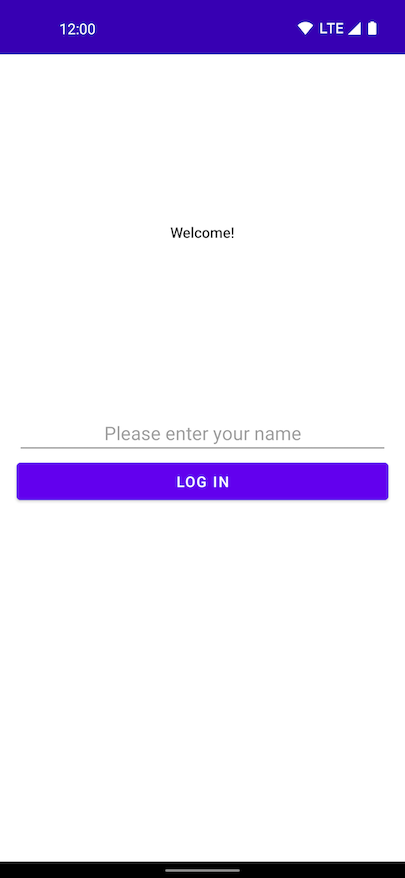
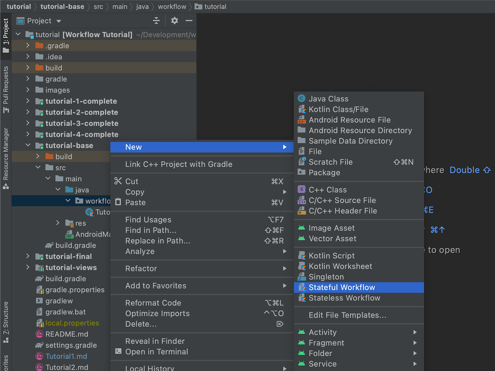
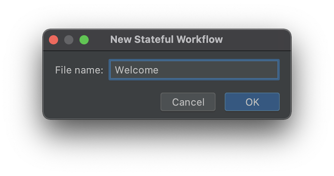
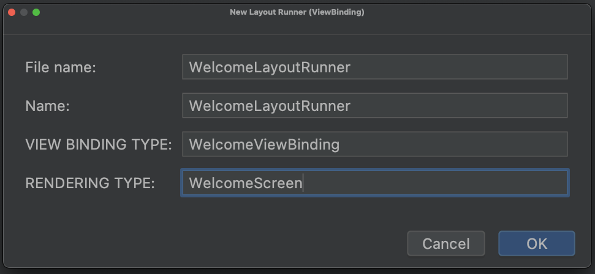

# Step 1

_Let's get something on the screen..._

## Setup

To follow this tutorial, launch Android Studio and open this folder (`samples/tutorial`).

The `tutorial-base` module will be our starting place to build from.

The welcome screen should look like:



You can enter a name, but the login button won't do anything.

## First Workflow

Let's start by making a workflow and screen to back the welcome view.

Start by creating a new workflow and screen by creating a new file with the [file templates](../../install-templates.sh), adding it to the `tutorial-base` module:

___Note___

_Windows OS users: Please add the scripts from [file templates folder](../../fileTemplates) directly to Android Studio or Intellij Idea._

_Go to Settings --> Editor --> File and Code Templates --> Select Files Tab. Now click on the '+' icon and copy the the content of the Workflow file template to the editor and save it._




The template does not create everything needed. Manually add objects for `State` and `Output`. We'll define `WelcomeScreen` in a moment:

```kotlin
object WelcomeWorkflow : StatefulWorkflow<Unit, State, Output, WelcomeScreen>() {

  object State
  object Output

  override fun initialState(
    props: Unit,
    snapshot: Snapshot?
  ): State = TODO("Initialize state")

  override fun render(
    props: Unit,
    state: State,
    context: RenderContext
  ): WelcomeScreen {
    TODO("Render")
  }

  override fun snapshotState(state: State): Snapshot? = Snapshot.write {
    TODO("Save state")
  }
}
```

Use the `Layout Runner (ViewBinding)` template to create a second file.



```kotlin
class WelcomeLayoutRunner(
  private val binding: WelcomeViewBinding
) : LayoutRunner<WelcomeScreen> {

  override fun showRendering(
    rendering: WelcomeScreen,
    viewEnvironment: ViewEnvironment
  ) {
    TODO("Update ViewBinding from rendering")
  }

  companion object : ViewFactory<WelcomeScreen> by bind(
    WelcomeViewBinding::inflate, ::WelcomeLayoutRunner
  )
}
```

### Screens, View Factories, and Layout Runners

Let's start with what a "screen" is, and how it relates to views.

"Screen" is just the term we use to refer to a value type that represents the view model for a logical screen. Sometimes we'll even use the terms "screen" and "view model" interchangeably. It has no special type. Typically, a screen will be used as the rendering type for the workflow that is responsible for that screen. A screen is usually a data class, since that's the easiest way to make value type-like classes in Kotlin.

For our welcome screen, we'll create a new class and define what it needs for a backing view model:
```kotlin
data class WelcomeScreen(
  /** The current name that has been entered. */
  val username: String,
  /** Callback when the name changes in the UI. */
  val onUsernameChanged: (String) -> Unit,
  /** Callback when the login button is tapped. */
  val onLoginTapped: () -> Unit
)
```

Then we need to create a `ViewFactory` that knows how to create an Android `View` to draw the actual screen. The easiest way to create a `ViewFactory` is to create a layout runner. A layout runner is a class that has a reference to the view and knows how to update the view given an instance of a screen. In a typical app, every screen will have a layout runner. Layout runners can also work with AndroidX `ViewBinding`s, which we'll use to define the `WelcomeLayoutRunner`. We have a pre-built `WelcomeViewBinding` that you can use. This binding will be autogenerated from layout files in `tutorials-views` when you first build the app. If Android Studio does not automatically find the file, you can manually import it `import workflow.tutorial.views.databinding.WelcomeViewBinding`. However if you would like to create and lay out the view yourself instead, feel free to do so!

```kotlin
class WelcomeLayoutRunner(
  private val welcomeBinding: WelcomeViewBinding
) : LayoutRunner<WelcomeScreen> {

  override fun showRendering(
    rendering: WelcomeScreen,
    viewEnvironment: ViewEnvironment
  ) {
    // updateText and setTextChangedListener are helpers provided by the workflow library that take
    // care of the complexity of correctly interacting with EditTexts in a declarative manner.
    welcomeBinding.username.updateText(rendering.username)
    welcomeBinding.username.setTextChangedListener {
      rendering.onUsernameChanged(it.toString())
    }
    welcomeBinding.login.setOnClickListener { rendering.onLoginTapped() }
  }

  /**
   * Define a [ViewFactory] that will inflate an instance of [WelcomeViewBinding] and an instance
   * of [WelcomeLayoutRunner] when asked, then wire them up so that [showRendering] will be called
   * whenever the workflow emits a new [WelcomeScreen].
   */
  companion object : ViewFactory<WelcomeScreen> by bind(
      WelcomeViewBinding::inflate, ::WelcomeLayoutRunner
  )
}
```

The view is provided to the layout runner's constructor. `showRendering` is called immediately as part of the layout runner's initialization (see `ViewBindingViewFactory.buildView`), and anytime the backing screen is updated. Note that the `ViewFactory` is actually the layout runner's companion object – this is a convention that makes it easy to associate layout runners with their view factories, and refer to the factories later when we define the view registry.

Any time the screen is updated, the `WelcomeLayoutRunner` will now update the `name`, and `login` fields on the `WelcomeViewBinding`. We can't quite run yet, as we still need to fill in the basics of our workflow.

### Workflows and Rendering Type

The core responsibility of a workflow is to provide a complete "rendering" every time the related state updates. Let's go into the `WelcomeWorkflow` now, and have it return a `WelcomeScreen` in the `render` method.

```kotlin
object WelcomeWorkflow : StatefulWorkflow<Unit, State, Output, WelcomeScreen>() {

  // …

  override fun render(
    renderProps: Unit,
    renderState: State,
    context: RenderContext
  ): WelcomeScreen = WelcomeScreen(
      username = renderState.username,
      onUsernameChanged = {},
      onLoginTapped = {}
  )

  // …
}
```

### Setting up the View Registry and Activity

Now we have our `WelcomeWorkflow` rendering a `WelcomeScreen`, and have a layout runner that knows how to display with a `WelcomeScreen`. It's time to bind this all together and actually show it on the screen!

Since we're about to include functionality related to AndroidX `ViewModel`s, `build.gradle` should be updated with the following dependencies:

```groovy
dependencies {
  // ...
  implementation deps.activityktx
  implementation deps.viewmodelktx
  implementation deps.viewmodelsavedstate
}
```

We'll update the `TutorialActivity` to set its content using a `ViewRegistry` that points to our `LayoutRunner`'s `ViewFactory`:

```kotlin
@file:OptIn(WorkflowUiExperimentalApi::class)
package workflow.tutorial
// ...

// This doesn't look like much right now, but we'll add more layout runners shortly.
private val viewRegistry = ViewRegistry(WelcomeLayoutRunner)

class TutorialActivity : AppCompatActivity() {

  override fun onCreate(savedInstanceState: Bundle?) {
    super.onCreate(savedInstanceState)

    // Use an AndroidX ViewModel to start and host an instance of the workflow runtime that runs
    // the WelcomeWorkflow and sets the activity's content view using our view factories.
    val model: TutorialViewModel by viewModels()

    setContentView(
      WorkflowLayout(this).apply { start(model.renderings, viewRegistry) }
    )
  }
}

class TutorialViewModel(savedState: SavedStateHandle) : ViewModel() {
  val renderings: StateFlow<WelcomeScreen> by lazy {
    renderWorkflowIn(
      workflow = WelcomeWorkflow,
      scope = viewModelScope,
      savedStateHandle = savedState
    )
  }
}
```

Now, we've created a `ViewRegistry` that consists of, so far, only our `WelcomeLayoutRunner`'s `ViewFactory`, and we're using it to set the content view of our activity. When the activity is started, it will start running the `WelcomeWorkflow`.

## Driving the UI from Workflow State

Right now, the workflow isn't handling any of the events from the UI. Let's update it to be responsible for the login username as well as the action when the login button is pressed.

### State

All workflows have a `State` type that represents the internal state of the workflow. This should be all of the data for which *this* workflow is _responsible_. It usually corresponds to the state for the UI.

Let's model the first part of state that we want to track: the login `username`. Update the `State` to a `data class`  and include a username property. We will also need to update `initialState` to give an initial value:

```kotlin
object WelcomeWorkflow : StatefulWorkflow<Unit, State, Output, WelcomeScreen>() {

  data class State(
    val username: String
  )

  // …

  override fun initialState(
    props: Unit,
    snapshot: Snapshot?
  ): State = State(username = "")

  // …
}

```

Now that we have the state modeled, we'll send it to the UI every time a render pass happens. The text field will overwrite its value with whatever was provided.

If you run the app again, you'll see that it still behaves the same, letting you type into the username field. This is because we have only rendered the screen once.

You may have noticed that your workflow only has access to its `State` in a few functions, and even then in many cases it is read-only. This is intentional. Instead of allowing your Workflow to modify the state directly, the Workflow infrastructure manages the state for the various workflows that are running and triggers a re-render when appropriate. In order to update the workflow's internal state, we need to add an "Action",

### Actions

Actions define how a workflow handles events received from the outside world, such as UI events (e.g. button presses), network requests, data stores, etc. Generally a `WorkflowAction` is a function which defines a particular state transition or side effect. Typically you define a `WorkflowAction` by writing a function that returns the actual action. This makes it easy to pass parameters to your actions. The action itself may not execute right away.

Add a function called `onUsernameChanged` to update our internal state:

```kotlin
  private fun onUsernameChanged(username: String) = action {
    state = state.copy(username = username)
  }
```

The `action` function is a shorthand for implementing the `WorkflowAction` class yourself. You could also write:

```kotlin
  private fun onUsernameChanged(username: String) =
    object : WorkflowAction<Unit, State, Nothing>() {
      override fun Updater.apply() {
        state = state.copy(username = username)
      }
    }
```

We need to send this action back to the workflow any time the username changes. Update the `render` method to send it through a sink back to the workflow whenever the `onUsernameChanged` closure is called. The action sink is how UI events can trigger workflow updates. When an action is sent to the sink, the infrastructure will execute the action and trigger another render pass:

```kotlin
object WelcomeWorkflow : StatefulWorkflow<Unit, State, Output, WelcomeScreen>() {

  // …

  override fun render(
    renderProps: Unit,
    renderState: State,
    context: RenderContext
  ): WelcomeScreen = WelcomeScreen(
      username = renderState.username,
      onUsernameChanged = { context.actionSink.send(onUsernameChanged(it)) },
      onLoginTapped = {}
  )

  // …
}
```

### The update loop

If we run the app again, it will still behave the same but we are now capturing the username changes in our workflow's state, as well as having the UI show the username based upon the workflow's internal state.

To see this, change the action lambda to append an extra letter on the username received, eg:
```kotlin
  private fun onUsernameChanged(username: String) = action {
    state = state.copy(username = username + "a")
  }
```

Running the app again will have the username field suffixed with a letter 'a' on every keypress. We probably want to undo this change, but it demonstrates that the UI is being updated from the internal state.

Here is what is happening on each keypress:
1) The UI calls `onUsernameChanged` whenever the contents of the text field changes.
2) The lambda calls `context.actionSink.send(onUsernameChanged(it))`, which sends an action to be handled by the workflow.
3) The `apply` method on the action is called. The `Updater` receiver has a `state` property. The `state` property is a `var`, so when it is updated in `apply`, it updates the actual state.
    - This is effectively the same as this method being written `fun apply(fromState: State): Pair<State, Output?>` where it transforms the previous state into a new state.
4) As an action was just handled, the workflow must now be re-rendered so the `Screen` (and from it, the UI) can be updated.
    - `render` is called on the workflow. A new screen is returned with the updated `username` from the internal state.
5) The layout runner is provided the new screen with the call to `fun showRendering(rendering: WelcomeScreen, viewEnvironment: ViewEnvironment)`.
    - This layout runner updates the text field with the received username value, and also updates the callbacks for when the username changes or login is pressed.
6) The workflow waits for the next `WorkflowAction` to be received, and then the goes through the same update loop.

## Summary

In this tutorial, we covered creating a Screen, `LayoutRunner`, Workflow, and binding them together in an Activity and ViewModel with `ViewRegistry` and `renderWorkflowIn`. We also covered the Workflow being responsible for the state of the UI instead of the `LayoutRunner` or `View` being responsible.

Next, we will create a second screen and workflow, and then use composition to navigate between them.

[Tutorial 2](Tutorial2.md)
