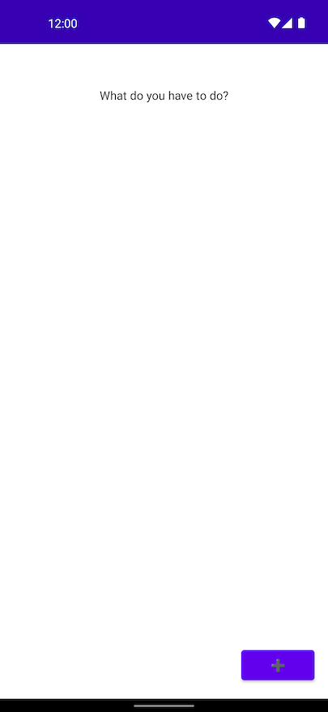
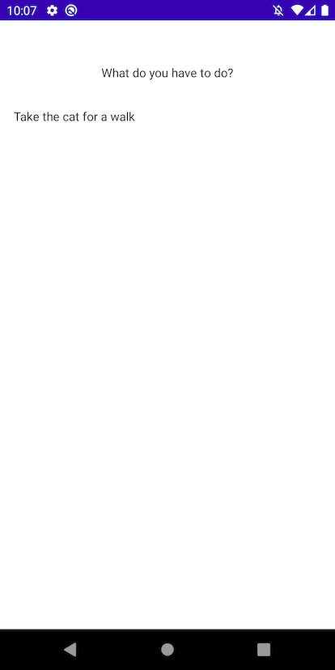
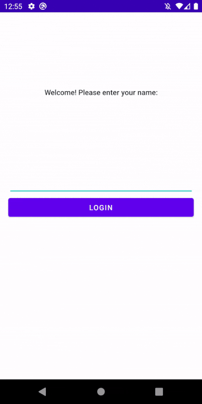

# Step 2

_Multiple Screens and Navigation_

## Setup

To follow this tutorial, launch Android Studio and open this folder (`samples/tutorial`).

Start from the implementation of `tutorial-1-complete` if you're skipping ahead.

## Second Workflow

Let's add a second screen and workflow so we have somewhere to land after we log in. Our next screen will be a list of "todo" items, as todo apps are the best apps.

Create a new screen called `TodoListScreen`, using the provided `TodoListViewBinding` from `tutorial-views`. Note the extra setup of an adapter for the `todoList` `RecyclerView`.

```kotlin
data class TodoListScreen(
  val TBD: String = ""
) : AndroidScreen<TodoListScreen> {
  override val viewFactory =
    ScreenViewFactory.fromViewBinding(TodoListViewBinding::inflate, ::todoListScreenRunner)
}

private fun todoListScreenRunner(
  todoListBinding: TodoListViewBinding
): ScreenViewRunner<TodoListScreen> {
  // This outer scope is run only once, right after the view is inflated.
  val adapter = TodoListAdapter()

  todoListBinding.todoList.layoutManager = LinearLayoutManager(todoListBinding.root.context)
  todoListBinding.todoList.adapter = adapter

  return ScreenViewRunner { screen: TodoListScreen, _ ->
    // This inner lambda is run on each update.
  }
}
```

And then create the corresponding `TodoListWorkflow`.

Modify `render()` to return a `TodoListScreen`.
Modify `State` data class to contain a placeholder parameter, to make the compiler happy.
We can leave everything else as the default for now:

```kotlin
object TodoListWorkflow : StatefulWorkflow<Unit, State, Nothing, TodoListScreen>() {

  data class State(val placeholder: String = "")

  override fun initialState(
    props: Unit,
    snapshot: Snapshot?
  ): State = State("initial")

  override fun render(
    renderProps: Unit,
    renderState: State,
    context: RenderContext
  ): TodoListScreen {
    return TodoListScreen()
  }

  override fun snapshotState(state: State) = null
}
```

### Showing the new screen and workflow

For now, let's just show this new screen instead of the login screen/workflow. Update the activity to show the `TodoListWorkflow`:

```kotlin
  val renderings: Flow<Screen> by lazy {
    renderWorkflowIn(
      workflow = TodoListWorkflow,
      scope = viewModelScope,
      savedStateHandle = savedState
    )
  }
```

Run the app again, and now the empty todo list will be shown:



## Populating the Todo List

The empty list is rather boring, so let's fill it in with some sample data for now.
Update the `State` type to include a list of todo model objects and change `initialState` to include a default one:

```kotlin
object TodoListWorkflow : StatefulWorkflow<Unit, State, Nothing, TodoListScreen>() {

  data class TodoModel(
    val title: String,
    val note: String
  )

  data class State(
    val todos: List<TodoModel>
  )

  override fun initialState(
    props: Unit,
    snapshot: Snapshot?
  ) = State(
    listOf(
      TodoModel(
        title = "Take the cat for a walk",
        note = "Cats really need their outside sunshine time. Don't forget to walk " +
          "Charlie. Hamilton is less excited about the prospect."
      )
    )
  )

  // …
}
```

Add a `todoTitles` property to the `TodoListScreen`,
and fill in the `ScreenViewRunner` to update the `TodoListViewBinding`
to change what it shows anytime the screen updates:

```kotlin
data class TodoListScreen(
  val todoTitles: List<String>
) : AndroidScreen<TodoListScreen> {
  override val viewFactory =
    ScreenViewFactory.fromViewBinding(TodoListViewBinding::inflate, ::todoListScreenRunner)
}

private fun todoListScreenRunner(
  todoListBinding: TodoListViewBinding
): ScreenViewRunner<TodoListScreen> {
  val adapter = TodoListAdapter()

  todoListBinding.todoList.layoutManager = LinearLayoutManager(todoListBinding.root.context)
  todoListBinding.todoList.adapter = adapter

  return ScreenViewRunner { screen: TodoListScreen, _ ->
    adapter.todoList = screen.todoTitles
    adapter.notifyDataSetChanged()
 }
}
```

Finally, update `render` for `TodoListWorkflow` to send the titles of the todo models whenever the screen is updated:

```kotlin
object TodoListWorkflow : StatefulWorkflow<Unit, State, Nothing, TodoListScreen>() {

  // …

  override fun render(
    renderProps: Unit,
    renderState: State,
    context: RenderContext
  ): TodoListScreen {
    val titles = renderState.todos.map { it.title }

    return TodoListScreen(
      todoTitles = titles,
    )
  }

  // …
}
```

Run the app again, and now there should be a single visible item in the list:



## Composition and Navigation

Now that there are two different screens,
we can make our first workflow showing composition with a single parent and two child workflows.
Our `WelcomeWorkflow` and `TodoListWorkflow` will be the leaf nodes
with a new workflow as the root.

### Root Workflow

Create a new `RootNavigationWorkflow` with the templates.
This time, set the rendering type to `com.squareup.workflow1.ui.Screen`,
workflow's general interface for view model types.
This will allow us to eventually render multiple screens each of a different type.

We'll start, though, with it returning a rendering only showing the `WelcomeScreen`
by delegating to the `WelcomeWorkflow`.

```kotlin
object RootNavigationWorkflow : StatefulWorkflow<Unit, Unit, Nothing, Screen>() {

  override fun initialState(
    props: Unit,
    snapshot: Snapshot?
  ): Unit = Unit

  override fun render(
    renderProps: Unit,
    renderState: Unit,
    context: RenderContext
  ): Screen {
    // Render a child workflow of type WelcomeWorkflow. When renderChild is called, the
    // infrastructure will start a child workflow session if one is not already running.
    val welcomeScreen = context.renderChild(WelcomeWorkflow) { output ->
    }
    return welcomeScreen
  }

  override fun snapshotState(state: State): Snapshot? = null
}
```

However, this won't compile immediately, and the compiler will provide a less than useful error message:


Any time a child workflow is run, the parent needs a way of converting
the child's `OutputT` into a `WorkflowAction` the parent can handle.
But `WelcomeWorkflow`'s output type is currently a simple object: `object Output`.

For now, delete the `Output` on `WelcomeWorkflow` and replace it with `Nothing`:

```kotlin
object WelcomeWorkflow : StatefulWorkflow<Unit, State, Nothing, WelcomeScreen>() {
  // …
}
```

Remove the lambda at the end of `context.renderChild(WelcomeWorkflow)`.
The override for using `renderChild` on a child Workflow with `Nothing` as its output type does not have a lambda parameter:

```kotlin
  override fun render(
    renderProps: Unit,
    renderState: Unit,
    context: RenderContext
  ): Screen {
    // Render a child workflow of type WelcomeWorkflow. When renderChild is called, the
    // infrastructure will start a child workflow session if one is not already running.
    val welcomeScreen = context.renderChild(WelcomeWorkflow)
    return welcomeScreen
  }
```

Update the `TutorialActivity` to start at the new `RootNavigationWorkflow`.

At the same time, add a `reportNavigation()` call when creating the `renderings` `Flow`.

```kotlin
  val renderings: Flow<Screen> by lazy {
    renderWorkflowIn(
      workflow = RootNavigationWorkflow,
      scope = viewModelScope,
      savedStateHandle = savedState
    )
  }.reportNavigation {
  Log.i("navigate", it.toString())
}
```

Now when you run the app we'll see the welcome screen again.
If you look at `logcat` you'll see a line saying as much:

```kotlin
navigate  WelcomeScreen(promptText=, onLogInTapped=Function1<E, kotlin.Unit>)
```

Of course that's the same screen that we saw before.
But this time we're seeing it because `RootNavigationWorkflow` chose to run it.

### Navigating between Workflows

Now that there is a root workflow,
it can be updated to navigate between the `Welcome` and `TodoList` workflows.

Start by defining the state that needs to be tracked at the root —
specifically which screen we're showing, and the actions to log in and log out:

```kotlin
object RootNavigationWorkflow : StatefulWorkflow<Unit, State, Nothing, WelcomeScreen>() {

  sealed interface State {
    object ShowingWelcome : State
    data class ShowingTodo(val username: String) : State
  }

  override fun initialState(
    props: Unit,
    snapshot: Snapshot?
  ): State = ShowingWelcome

  // …

  private fun logIn(username: String) = action("logIn") {
    state = ShowingTodo(username)
  }

  private val logOut = action("logOut") {
    state = ShowingWelcome
  }
}
```

The root workflow is now modeling our states and actions.
Soon we will be able to navigate between the welcome and todo list screens.

### Workflow Output

Workflows can only communicate with each other through their "properties" as inputs and "outputs" as actions.
When a child workflow emits an output,
the parent workflow will receive it and map it into an action the parent can handle.

Our welcome workflow has a Log In button that doesn't do much.
Let's update it to let our parent know that we have "logged in"
and are ready to navigate to another screen.

Change our `OutputT` type from `Output` to a new `data class LoggedIn`
to be able to signal our parent:

```kotlin
object WelcomeWorkflow : StatefulWorkflow<Unit, State, LoggedIn, WelcomeScreen>() {

  data class LoggedIn(val username: String)

  // …
}
```

And post a `LoggedIn` output any time the Log In button is pressed
(provided we receive a useful `name`):

```kotlin
  ): WelcomeScreen = WelcomeScreen(
    promptText = renderState.prompt,
    onLogInTapped = context.eventHandler("onLogInTapped") { name ->
      if (name.isEmpty()) {
        state = state.copy(prompt = "name required to log in")
      } else {
        setOutput(LoggedIn(name))
      }
    }
  )
```

Finally, map the output event from `WelcomeWorkflow` in `RootNavigationWorkflow` to the `LoggedIn` action:

```kotlin
  override fun render(
    renderProps: Unit,
    renderState: Unit,
    context: RenderContext
  ): Screen {
    // Render a child workflow of type WelcomeWorkflow. When renderChild is called, the
    // infrastructure will start a child workflow session if one is not already running.
    val welcomeScreen = context.renderChild(WelcomeWorkflow) { output ->
      // When WelcomeWorkflow emits its LoggedIn output, map that to our logIn action.
      logIn(output.username)
    }
    return welcomeScreen
  }
```

### Showing a different workflow from state

Now we are handling the `LoggedIn` output of `WelcomeWorkflow`,
and updating the state to show the Todo screen.
However, we still need to update our render method to delegate to a different workflow
when we're in the `ShowingTodo` state.

We'll update the `RootNavigationWorkflow` `render` method to show either the `WelcomeWorkflow` or `TodoListWorkflow` depending on the `renderState`.

Temporarily define the `OutputT` of `TodoListWorkflow` as `Nothing` (we can only go forward!):

```kotlin
object TodoListWorkflow : StatefulWorkflow<Unit, State, Nothing, TodoListScreen>() {
```

And update the `render` method of `RootNavigationWorkflow`:

```kotlin
object RootNavigationWorkflow : StatefulWorkflow<Unit, State, Nothing, Screen>() {

  // …

  override fun render(
    renderProps: Unit,
    renderState: State,
    context: RenderContext
  ): Screen {
    when (renderState) {
      // When the state is ShowingWelcome, delegate to the WelcomeWorkflow.
      is ShowingWelcome -> {
        // Render a child workflow of type WelcomeWorkflow. When renderChild is called, the
        // infrastructure will create a child workflow with state if one is not already running.
        val welcomeScreen = context.renderChild(WelcomeWorkflow) { output ->
          // When WelcomeWorkflow emits LoggedIn, turn it into our login action.
          logIn(output.username)
        }
        return welcomeScreen
      }

      // When the state is ShowingTodo, delegate to the TodoListWorkflow.
      is ShowingTodo -> {
        val todoScreen = context.renderChild(TodoListWorkflow, Unit)
        return todoScreen
      }
    }
  }

  // …
}
```

This works, but with no animation between the two screens it's pretty unsatisfying.
We'll fix that by using a different "container" to provide the missing transition animation.

### Workflow Props

So far we are gathering a username from the welcome screen,
and there's a place on the todo list screen to display the username,
but we're not passing the username from the welcome screen to the list screen.
We'll fix this by passing the username down from the `RootNavigationWorkflow` to the `TodoListWorkflow` via "props".

Every workflow has a `PropsT` parameter type
that allows parents to send information to their children.
It's the first parameter in the type parameter list.
If a workflow doesn't need any data from its parent,
it can use `Unit` as its props type.
When rendering a child, a valid props value must always be passed to `renderChild`.
The child workflow has access to the props from its parent in a few places:

- `initialState` – the first time the parent renders the child,
  the props value it provides is passed to this function.

- `onPropsChanged` – this function is only called when the parent passes a props value
  to `renderChild` that is unequal to the one provided on the previous `renderChild` call.
  This method gets both the old and the new props,
  and can return an updated state to reflect those changes.

- `render` – gets the props the parent passed to `renderChild` by the parent.
 The first time this workflow is rendered,
 this props will be the same as the value that was passed to `initialState`.

- `WorkflowAction.apply` – when an action is applied,
  the `Updater` receiver has a reference to the last props used to render the workflow
  that the action is being applied to.
  In terms of sequencing, actions always happen _between_ renders.

Note that unlike output, which is how a child sends events to its parent,
props does not represent events.
In fact, another way to think of props is another kind of state – the "public" part of its state, if you will.

A workflow's props is similar to its state in this sense:
any time the workflow is "alive", it has a current state and a current props.
The _state_ is readable and writable, and owned by the workflow itself —
the workflow changes its own state.
The _props_ are read-only, and owned by the workflow's parent.
The child can't change its props, it can only observe the props its parent decided to pass down.

So you can think of a workflow has having a composite state, `PropsT` + `StateT`,
with `PropsT` being the public portion provided by the parent,
and `StateT` modeling the child's private concerns.

Let's update `TodoListWorkflow` with a new `ListProps`
and use it to receive a `username` string.
We will also need to update `TodoListScreen` to display it.

```kotlin
object TodoListWorkflow : StatefulWorkflow<ListProps, State, Nothing, TodoListScreen>() {

  data class ListProps(val username: String)

  // …

  override fun initialState(
    props: ListProps,
    snapshot: Snapshot?
  ): State = State(
    // …
  )

  override fun render(
    renderProps: ListProps,
    renderState: State,
    context: RenderContext
  ): TodoListScreen {
    username = renderProps.username,
    todoTitles = titles,
  }
```

```kotlin
data class TodoListScreen(
  val username: String,
  val todoTitles: List<String>,
) : AndroidScreen<TodoListScreen> {

// …

  return ScreenViewRunner { screen: TodoListScreen, _ ->
    // This inner lambda is run on each update.
    with(todoListBinding.todoListWelcome) {
      text = resources.getString(R.string.todo_list_welcome, screen.username)
    }

    adapter.todoList = screen.todoTitles
  }
}
```

Now update `RootNavigationWorkflow` to pass `ListProps` when starting `TodoListWorkflow`:

```kotlin
object RootNavigationWorkflow : StatefulWorkflow<Unit, State, Nothing, Screen>() {

  // …

  override fun render(
    renderProps: Unit,
    renderState: State,
    context: RenderContext
  ): Screen {
    when (renderState) {
      // …

      // When the state is ShowingTodo, defer to the TodoListWorkflow.
      is ShowingTodo -> {
        val todoScreen = context.renderChild(
          child = TodoListWorkflow,
          props = ListProps(username = renderState.username)
        ) {
          TODO() // we'll handle output of TodoListWorkflow later
        }
        return todoScreen
      }
    }
  }
  // …
}
```

### Back Stack

We want to animate changes between our screens.
We can use the `BackStackScreen` to do this in a declarative fashion.
Update the `RootNavigationWorkflow` to use `BackStackScreen<*>` as its `RenderT` type:

```kotlin
object RootNavigationWorkflow : StatefulWorkflow<Unit, State, Nothing, BackStackScreen<*>>() {

  // …

  override fun render(
    renderProps: Unit,
    renderState: State,
    context: RenderContext
  ): BackStackScreen<*> {
    // We always render the welcomeScreen regardless of the current state.
    // It's either showing or else we may want to pop back to it.
    val welcomeScreen = context.renderChild(WelcomeWorkflow) { loggedIn ->
      // When WelcomeWorkflow emits LoggedIn, enqueue our log in action.
      logIn(loggedIn.username)
    }

    return when (renderState) {
      is ShowingWelcome -> {
        BackStackScreen(welcomeScreen)
      }

      is ShowingTodo -> {
        val todoBackStack = context.renderChild(
          child = TodoListWorkflow,
          props = ListProps(renderState.username),
          handler = {
            // When TodoNavigationWorkflow emits Back, enqueue our log out action.
            logOut
          }
        )
        listOf(welcomeScreen, todoBackStack).toBackStackScreen()
      }
    }
  }
```

We also need to update the output type of `TodoListWorkflow`.
So far it has output `Nothing`.
Define a `BackPressed` object and use it as `TodoListWorkflow`'s output type.
Update `render()` to create an `eventHandler` function to post the new output event.

At the same time, use workflow's handy `View.setBackHandler` function to respond to Android back press events.

> [!NOTE]
> `View.setBackHandler` is implemented via
> [OnBackPressedCallback](https://developer.android.com/reference/androidx/activity/OnBackPressedCallback)
> and so plays nicely with the
> [OnBackPressedDispatcher](https://developer.android.com/reference/androidx/activity/OnBackPressedDispatcher), Compose's [BackHandler](https://foso.github.io/Jetpack-Compose-Playground/activity/backhandler/)
> and Android's [predictive back gesture](https://developer.android.com/guide/navigation/custom-back/predictive-back-gesture).

```kotlin
object TodoListWorkflow : StatefulWorkflow<ListProps, State, BackPressed, TodoListScreen>() {

  // ...

  object BackPressed

  // ...

  override fun render(
    renderProps: ListProps,
    renderState: State,
    context: RenderContext
  ): TodoListScreen {
    val titles = renderState.todos.map { it.title }
    return TodoListScreen(
      username = renderProps.username,
      todoTitles = titles,
      onBackPressed = context.eventHandler("onBackPressed") { setOutput(BackPressed) }
    )
  }
```

```kotlin
data class TodoListScreen(
  val username: String,
  val todoTitles: List<String>,
  val onBackPressed: () -> Unit,
) : AndroidScreen<TodoListScreen> {

  // …

  return ScreenViewRunner { screen: TodoListScreen, _ ->
    // This inner lambda is run on each update.
    todoListBinding.root.setBackHandler(screen.onBackPressed)

    with(todoListBinding.todoListWelcome) {
      text = resources.getString(R.string.todo_list_welcome, screen.username)
    }

    adapter.todoList = screen.todoTitles
    adapter.notifyDataSetChanged()
  }
}
```



Neat! We can now log in and log out, and show the username entered as our title!

```shell
navigate  WelcomeScreen(promptText=, onLogInTapped=Function1<E, kotlin.Unit>)
navigate  TodoListScreen(username=David, todoTitles=[Take the cat for a walk], onRowPressed=Function1<java.lang.Integer, kotlin.Unit>, onBackPressed=Function0<kotlin.Unit>, onAddPressed=Function0<kotlin.Unit>)
navigate  WelcomeScreen(promptText=, onLogInTapped=Function1<E, kotlin.Unit>)
```

> [!TIP]
> Note the logging above remains useful
> even though we are now wrapping our leaf screens in a `BackStackScreen`.
> The default `onNavigate` function used by `Flow<*>.reportNavigation()`
> can drill through the stock `Unwrappable` interface implemented by `BackStackScreen`
> and other wrapper rendering types.
> You can write your own wrapper types in the same manner
> to ensure they are similarly introspectable (handy for both logging and testing),
> and to control how they are logged by tools like `onNavigate()`.

### On Navigation

Let's take a moment to discuss just what that `BackStackScreen` is doing,
and workflow's philosophy on navigation in general.

`BackStackScreen` is one of workflow's standard navigation containers,
and it's also `Screen` — just another "view model" value type.
There is no `BackStackWorkflow`, there are no `push`, `pop` or `goto` methods,
there is no `NavigationBackbone`, or anything like that.

What you just implemented here in `RootNavigationWorkflow` is all that there is
on the back stack front, because we believe it is all that any app needs
for push / pop navigation.

Our experience with capital "N" Navigation Frameworks (including the first one that we wrote)
has been that their model is not ours,
and that as our apps scale to not-even-all-that-big
we find ourselves needing to engineer around the framework instead of just writing our features.

So our idiom for back stack management is to write workflows just like this one, which:

- keeps track of what children are currently in play and to which it may return, and
- collects their `Screen` renderings in a widget (`BackStackScreen`) which is:
   - good at recognizing if the stack of screens it's managing just grew or shrank and
   - playing a push or a pop animation accordingly while also
   - taking care to save and restore view system state of pushed and popped screens

Workflow's `BackStackScreen` and the view code that expresses it are our only reusable back stack bits.
Your navigation will be pretty bespoke pretty quickly,
and is more likely than not to be strait-jacketed by anything more opinionated on the presenter side.

That's really the tl;dr: of the Workflow library:

- Workflows are state-machine style presenters that are good at recursion
- Navigation is just another presenter concern like any other

You may be wondering at this point "but how does this scale?"
We'll show you how in the next tutorial, when we add our Todo Editing screen.

> [!TIP]
> `BackStackScreen` isn't the only navigation UI primitive that workflow provides,
> (though so far it is the only one covered by this tutorial, sorry sorry sorry.)
> If you look in [the `navigation` package](https://github.com/square/workflow-kotlin/blob/main/workflow-ui/core-common/src/main/java/com/squareup/workflow1/ui/navigation/) you will also see:
>
>  - The `Overlay` marker interface, implemented by renderings that model things like Android `Dialog` windows
>  - `ScreenOverlay`  for modeling an `Overlay` whose content comes from a `Screen`
>  - `BodyAndOverlaysScreen`, a class that arranges `Overlay` instances in layers over a body `Screen`.
>  - And the [`AndroidOverlay`](https://github.com/square/workflow-kotlin/blob/main/workflow-ui/core-android/src/main/java/com/squareup/workflow1/ui/navigation/AndroidOverlay.kt) interface that simplifies implementing `ScreenOverlay` with Android's `AppCompatDialog` class.

[Tutorial 3](Tutorial3.md)
