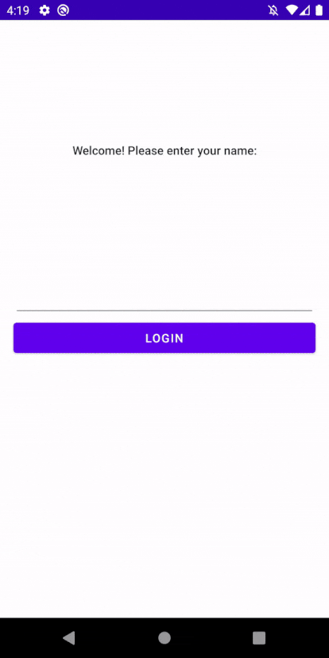

# Step 3

_State throughout a tree of workflows_

## Setup

To follow this tutorial, launch Android Studio and open this folder (`samples/tutorial`).

Start from the implementation of `tutorial-2-complete` if you're skipping ahead.

## Editing todo items

Now that a user can "log in" to their todo list, we want to add the ability to edit the todo items listed.

### State ownership

In the workflow framework, data flows _down_ the tree as properties set by parents on their child workflows, and comes _up_ as output events to their parents (as in the traditional computer science sense that trees that grow downward).

What this means is that state should be created as far down the tree as possible, to limit the scope of state to be as small as possible. Additionally, there should be only one "owner" of the state in the tree - if it's passed farther down the tree, it should be a copy or read-only version of it - so there is no shared mutable state in multiple workflows.

When a child workflow has a copy of the state from its parent, it should change it by emitting an _output_ back to the parent, requesting that it be changed. The child will then receive an updated copy of the data from the parent - keeping ownership at a single level of the tree.

This is all a bit abstract, so let's make it more concrete by adding an edit todo item workflow.

### Create an todo edit workflow and screen

Using the templates, create a `TodoEditWorkflow` and `TodoEditLayoutRunner`.

#### TodoEditScreen

Create an empty `TodoEditScreen` class that will be used as the rendering type for our new workflow
and layout runner.

```kotlin
data class TodoEditScreen(
  // The `TodoEditScreen` is empty to start. We'll add the contents later on.
)
```

```kotlin
class TodoEditLayoutRunner(
  private val binding: TodoEditViewBinding
) : LayoutRunner<TodoEditScreen> {

  override fun showRendering(
    rendering: TodoEditScreen,
    viewEnvironment: ViewEnvironment
  ) {
    // TODO
  }

  companion object : ViewFactory<TodoEditScreen> by bind(
      TodoEditViewBinding::inflate, ::TodoEditLayoutRunner
  )
}
```

This view isn't particularly useful without the data to present it, so update the `TodoEditScreen` to add the properties we need and the callbacks:

```kotlin
data class TodoEditScreen(
  /** The title of this todo item. */
  val title: String,
  /** The contents, or "note" of the todo. */
  val note: String,

  /** Callbacks for when the title or note changes. */
  val onTitleChanged: (String) -> Unit,
  val onNoteChanged: (String) -> Unit,

  val discardChanges: () -> Unit,
  val saveChanges: () -> Unit
)
```

Then update the view with the data from the screen:

```kotlin
class TodoEditLayoutRunner(
  private val binding: TodoEditViewBinding
) : LayoutRunner<TodoEditScreen> {

  override fun showRendering(
    rendering: TodoEditScreen,
    viewEnvironment: ViewEnvironment
  ) {
    binding.root.backPressedHandler = rendering.discardChanges
    binding.save.setOnClickListener { rendering.saveChanges() }
    binding.todoTitle.updateText(rendering.title)
    binding.todoTitle.setTextChangedListener { rendering.onTitleChanged(it.toString()) }
    binding.todoNote.updateText(rendering.note)
    binding.todoNote.setTextChangedListener { rendering.onNoteChanged(it.toString()) }
  }

  // …
}
```

#### TodoEditWorkflow

Now that we have our screen and layout runner, let's update the `TodoEditWorkflow` to emit this screen as the rendering.

The `TodoEditWorkflow` needs an initial Todo item passed into it from its parent. It will make a copy of it in its internal state (because `TodoModel` is a value type) — this can be the "scratch pad" for edits. This allows changes to be made and still be able to discard the changes if the user does not want to save them.

Additionally, we will (finally) use the `onPropsChanged` method. If the edit workflow's parent provides an updated `todo`, it will invalidate the `todo` in `State`, and replace it with the one provided from the props.

```kotlin
object TodoEditWorkflow : StatefulWorkflow<EditProps, State, Output, TodoEditScreen>() {

  data class EditProps(
    /** The "Todo" passed from our parent. */
    val initialTodo: TodoModel
  )

  data class State(
    /** The workflow's copy of the Todo item. Changes are local to this workflow. */
    val todo: TodoModel
  )

  sealed class Output {
  }

  override fun initialState(
    props: EditProps,
    snapshot: Snapshot?
  ): State = State(props.initialTodo)

  override fun onPropsChanged(
    old: EditProps,
    new: EditProps,
    state: State
  ): State {
    // The `Todo` from our parent changed. Update our internal copy so we are starting from the same
    // item. The "correct" behavior depends on the business logic - would we only want to update if
    // the users hasn't changed the todo from the initial one? Or is it ok to delete whatever edits
    // were in progress if the state from the parent changes?
    if (old.initialTodo != new.initialTodo) {
      return state.copy(todo = new.initialTodo)
    }
    return state
  }

  // …
}
```

Next, define the actions this workflow will handle - specifically the title and note changing from the UI:

```kotlin
object TodoEditWorkflow : StatefulWorkflow<EditProps, State, Output, TodoEditScreen>() {

  // …

  private fun onTitleChanged(title: String) = action {
    state = state.withTitle(title)
  }

  private fun onNoteChanged(note: String) = action {
    state = state.withNote(note)
  }

  private fun onDiscard() = action {
    // Emit the Discard output when the discard action is received.
    setOutput(Discard)
  }

  private fun onSave() = action {
    // Emit the Save output with the current todo state when the save action is received.
    setOutput(Save(state.todo))
  }

  private fun State.withTitle(title: String) = copy(todo = todo.copy(title = title))
  private fun State.withNote(note: String) = copy(todo = todo.copy(note = note))
```

Finally, update the `render` method to return a `TodoEditScreen`:

```kotlin
object TodoEditWorkflow : StatefulWorkflow<EditProps, State, Output, TodoEditScreen>() {

  // …

  override fun render(
    renderProps: EditProps,
    renderState: State,
    context: RenderContext
  ): TodoEditScreen {
    return TodoEditScreen(
        title = state.todo.title,
        note = state.todo.note,
        onTitleChanged = { context.actionSink.send(onTitleChanged(it)) },
        onNoteChanged = { context.actionSink.send(onNoteChanged(it)) },
        saveChanges = { context.actionSink.send(onSave()) },
        discardChanges = { context.actionSink.send(onDiscard()) }
    )
  }

  // …
}
```

Now the workflow provides a backing for the UI to edit a todo item, but it doesn't support saving and discarding changes. Add two `Output`s and actions for these cases:

```kotlin
object TodoEditWorkflow : StatefulWorkflow<EditProps, State, Output, TodoEditScreen>() {

  // …

  sealed class Output {
    object Discard : Output()
    data class Save(val todo: TodoModel) : Output()
  }

  // …
}
```

## Todo Editing in the full flow

### Updating the current workflows to prepare to add the edit workflow

We want the todo edit screen to be shown when a user taps on an item on the todo list screen. To do this, we will modify the todo list workflow to show the edit screen when we are editing.

The `TodoListWorkflow` will now occasionally need to render two screens instead of just the one. Its parent workflow will add the one or two screens to the backstack it constructs. Since `TodoListWorkflow`'s rendering type is `Any`, it can just return a list of screens. However, the parent workflow needs to know about the list, so it can pull the screens out and add them to its backstack. We'll change the rendering type from `Any` to `List<Any>`:

```kotlin
object TodoListWorkflow : StatefulWorkflow<ListProps, State, Back, List<Any>>() {

  // …

  override fun render(
    renderProps: ListProps,
    renderState: State,
    context: RenderContext
  ): List<Any> {
    val titles = state.todos.map { it.title }
    val todoListScreen = TodoListScreen(
        username = props.username,
        todoTitles = titles,
        onTodoSelected = { context.actionSink.send(selectTodo(it)) },
        onBack = { context.actionSink.send(onBack()) }
    )

    return listOf(todoListScreen)
  }
}
```

Next, update the `RootWorkflow` to pass the username into the `TodoListWorkflow` and handle the `.back` output:

```kotlin
object RootWorkflow : StatefulWorkflow<Unit, State, Nothing, BackStackScreen<*>>() {

  // …

  override fun render(
    renderProps: Unit,
    renderState: State,
    context: RenderContext
  ): BackStackScreen<*> {
    // Our list of back stack items. Will always include the "WelcomeScreen".
    val backstackScreens = mutableListOf<Any>()

    // Render a child workflow of type WelcomeWorkflow. When renderChild is called, the
    // infrastructure will create a child workflow with state if one is not already running.
    val welcomeScreen = context.renderChild(WelcomeWorkflow) { output ->
      // When WelcomeWorkflow emits LoggedIn, turn it into our login action.
      login(output.username)
    }
    backstackScreens += welcomeScreen

    when (state) {
      // When the state is Welcome, defer to the WelcomeWorkflow.
      is Welcome -> {
        // We always add the welcome screen to the backstack, so this is a no op.
      }

      // When the state is Todo, defer to the TodoListWorkflow.
      is Todo -> {
        val todoListScreens = context.renderChild(TodoListWorkflow, ListProps(state.username)) {
          logout()
        }
        backstackScreens.addAll(todoListScreens)
      }
    }

    // Finally, return the BackStackScreen with a list of BackStackScreen.Items
    return backstackScreens.toBackStackScreen()
  }

  // …
}
```

Run the app again to validate it still behaves the same.

### Adding the edit workflow as a child to the `TodoListWorkflow`

Now that the `TodoListWorkflow`'s rendering is a list of screens, it can be updated to show the edit workflow when a `Todo` item is tapped.

Modify the state to represent if the list is being viewed, or an item is being edited:

```kotlin
object TodoListWorkflow : StatefulWorkflow<ListProps, State, Back, List<Any>>() {

  data class ListProps(val username: String)

  data class State(
    val todos: List<TodoModel>,
    val step: Step
  ) {
    sealed class Step {
      /** Showing the list of items. */
      object List : Step()

      /**
       * Editing a single item. The state holds the index so it can be updated when a save action is
       * received.
       */
      data class Edit(val index: Int) : Step()
    }
  }

  // …
}
```

Add actions for selecting a todo item as well as saving or discarding the changes:

```kotlin
object TodoListWorkflow : StatefulWorkflow<ListProps, State, Back, List<Any>>() {

  // …

  private fun discardChanges() = action {
    // When a discard action is received, return to the list.
    state = state.copy(step = Step.List)
  }

  private fun saveChanges(
    todo: TodoModel,
    index: Int
  ) = action {
    // When changes are saved, update the state of that todo item and return to the list.
    state = state.copy(
        todos = state.todos.toMutableList().also { it[index] = todo },
        step = Step.List
    )
  }
}
```

Update the `render` method to defer to the `TodoEditWorkflow` when editing:

```kotlin
object TodoListWorkflow : StatefulWorkflow<ListProps, State, Back, List<Any>>() {

  // …

  override fun render(
    renderProps: ListProps,
    renderState: State,
    context: RenderContext
  ): List<Any> {
    val titles = state.todos.map { it.title }
    val todoListScreen = TodoListScreen(
        username = props.username,
        todoTitles = titles,
        onTodoSelected = { context.actionSink.send(selectTodo(it)) },
        onBack = { context.actionSink.send(onBack()) }
    )

    return when (val step = state.step) {
      // On the "list" step, return just the list screen.
      Step.List -> listOf(todoListScreen)
      is Step.Edit -> {
        // On the "edit" step, return both the list and edit screens.
        val todoEditScreen = context.renderChild(
            TodoEditWorkflow,
            props = EditProps(state.todos[step.index])
        ) { output ->
          when (output) {
            // Send the discardChanges action when the discard output is received.
            Discard -> discardChanges()
            // Send the saveChanges action when the save output is received.
            is Save -> saveChanges(output.todo, step.index)
          }
        }
        return listOf(todoListScreen, todoEditScreen)
      }
    }
  }

  // …
}
```

Now we have a (nearly) fully formed app! Try it out and see how the data flows between the different workflows:



### Data Flow

What we just built demonstrates how state should be handled in a tree of workflows:
* The `TodoListWorkflow` is responsible for the state of all the todo items.
* When an item is edited, the `TodoEditWorkflow` makes a _copy_ of it for its local state. The updates happen from the UI events (changing the title or note). Depending on if the user wants to save (hikes are fun!) or discard the changes (taking the cat for a swim is likely a bad idea), it emits an output of `Discard` or `Save`.
* When a `Save` output is emitted, it includes the updated todo model. The parent (`TodoListWorkflow`) updates its internal state for that one item. The child never knows the index of the item being edited, it only has the minimum state of the specific item. This lets the parent be able to safely update its array of todos without being concerned about index-out-of-bounds errors.

If so desired, the `TodoListWorkflow` could have additional checks for saving the changes. For instance, if the todo list was something fetched from a server, it may decide to discard any changes if the list was updated remotely, etc.

## Up Next

We now have a pretty fully formed app. However if we want to keep going and adding features, we may want to reshape our tree of workflows. In the next tutorial, we'll cover refactoring and changing the shape of our workflow hierarchy.

[Tutorial 4](Tutorial4.md)
